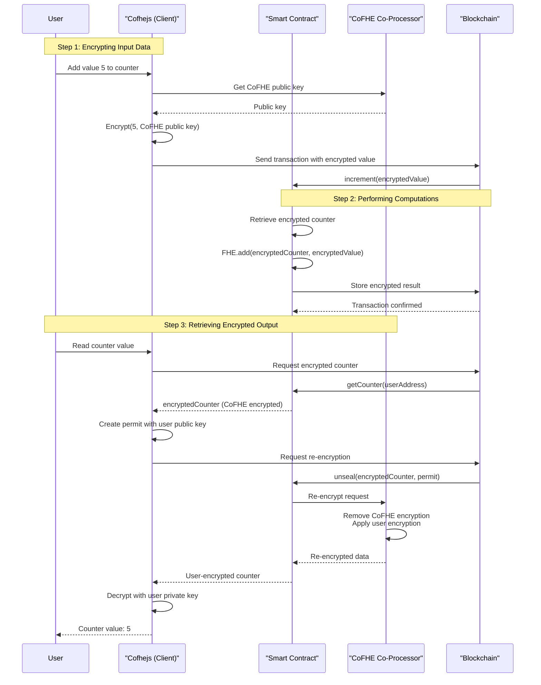

To understand how **Cofhejs** fits into the Fhenix framework, you'll explore a simple mental model using a Counter smart contract example. This will show you how data flows through FHE-enabled dApps—from encryption to computation to decryption.

## The Counter Example

Imagine a smart contract called **Counter** where each user has their own private counter. Users can increment their counter and read its value with complete privacy—no one, including the smart contract itself, can see the actual counter values.

### Key Concepts

- **Public Key** = A lock that anyone can use to seal data
- **Private Key** = The unique key to unlock sealed data
- **CoFHE Co-Processor** = Fhenix's off-chain service that handles FHE operations
- **Ciphertext** = Encrypted data that can be computed on without decryption

<Steps>

<Step title="Encrypting Input Data">

When a user wants to add `5` to their counter, the data must first be encrypted before being sent to the smart contract.

**What happens:**

1. The user's plaintext value `5` is encrypted using the CoFHE co-processor's public key
2. This creates ciphertext—encrypted data that appears as random bytes
3. The ciphertext is sent to the smart contract on-chain
4. The blockchain sees only encrypted data, never the actual value `5`

### The "Locked Box" Analogy

Think of this as placing the value `5` in a box and locking it with the CoFHE co-processor's public key. The locked box (ciphertext) can be sent to the smart contract, but no one can see what's inside without the private key.

</Step>

<Step title="Performing Computations on Encrypted Data">

Once the encrypted data reaches the smart contract, FHE magic happens. The smart contract can perform arithmetic operations directly on the ciphertext without ever decrypting it.

**What happens:**

1. The smart contract receives the encrypted value
2. It retrieves the user's encrypted counter from storage (also encrypted)
3. Using FHE operations, it adds the encrypted values together
4. The result is stored as encrypted data
5. **Critical**: At no point does the smart contract, blockchain, or anyone else see the actual numbers

### FHE Computation Magic

This is where Fully Homomorphic Encryption shines. The CoFHE co-processor enables the smart contract to:
- Add encrypted values together
- Compare encrypted values
- Perform other arithmetic operations
- All while the data remains encrypted and private

</Step>

<Step title="Retrieving Encrypted Output">

When a user wants to read their counter value, they need to retrieve the encrypted data and decrypt it. However, the data is encrypted with the CoFHE co-processor's public key, so the user needs to request re-encryption.

**What happens:**

1. The user retrieves their encrypted counter from the smart contract
2. The data is still encrypted with the CoFHE co-processor's public key
3. The user creates a permit with their own public key
4. The smart contract requests the CoFHE co-processor to re-encrypt the data
5. The co-processor removes its encryption and re-encrypts with the user's public key
6. The user can now decrypt the data using their private key

### The "Lock Exchange" Analogy

This is like exchanging locks on the box:
- The box starts locked with the CoFHE co-processor's lock
- The user sends their own lock to the co-processor
- The co-processor removes its lock and applies the user's lock
- The box remains locked throughout, but now only the user can open it
- The data remains private at every step

</Step>

</Steps>

## The Complete Flow

## Key Takeaways

1. **Encryption happens client-side**: Cofhejs encrypts data before it reaches the blockchain
2. **Computation happens on-chain**: Smart contracts perform operations on encrypted data
3. **FHE enables privacy-preserving computation**: The blockchain never sees plaintext values
4. **Re-encryption enables access control**: Only authorized users can decrypt their own data
5. **CoFHE co-processor is essential**: It handles the complex FHE operations off-chain

This architecture ensures that sensitive data remains private throughout its entire lifecycle—from input to computation to output—while still enabling powerful decentralized applications.
