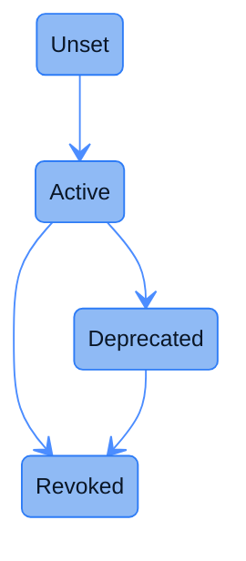

| Aspect | Description |
|--------|-------------|
| **Type** | UUPS-upgradeable Solidity contract deployed on a dedicated **registry chain**. |
| **Function** | Records `(version, handle) → commitHash` entries for every FHE operation result that the coprocessor produces. |
| **Responsibilities** | • Provide an authoritative source of ciphertext integrity that [Teecryptor](/deep-dive/cofhe-components/teecryptor) checks **before** decrypting.<br/>• Group commitments by an opaque `version` tag so a future tfhe-rs / FHE-parameter upgrade can roll out without invalidating earlier ciphertexts.<br/>• Enforce write-once semantics per `(version, handle)` to prevent commitment replacement.<br/>• Expose paginated enumeration so offchain tooling can audit what has been posted. |
| **Deployment** | One deployment per registry chain, behind an ERC-1967 proxy. |

## Why a separate registry chain?

[Teecryptor](/deep-dive/cofhe-components/teecryptor) needs to confirm that the ciphertext it is about to decrypt is **exactly** the one the FHE Engine produced, not a tampered or stale handle. The natural place to anchor that proof is onchain, but anchoring on every host chain would mean paying gas on N chains for every FHE operation. Instead, the coprocessor posts commitments to a **single registry chain**, and the decryption path watches only that one.

## Storage shape

```solidity
mapping(bytes32 version => mapping(bytes32 handle => bytes32 commitHash)) commitments;
mapping(bytes32 version => bytes32[])                                     handlesByVersion;
mapping(bytes32 version => VersionStatus)                                 versionStatus;
mapping(address => bool)                                                  posters;
```

`commitments` is the source-of-truth lookup. `handlesByVersion` is an array kept in parallel so paginated enumeration is `O(limit)` instead of `O(total)`. Storage lives at the ERC-7201 slot derived from `cofhe.storage.CommitmentRegistry`, so the contract is upgrade-safe.

## Version lifecycle

`version` is an opaque `bytes32` tag chosen by the coprocessor when FHE parameters change, currently the ASCII tag `"2"` (see [the FHE Engine `COMMITMENT_VERSION` notes](https://github.com/FhenixProtocol/cofhe/blob/master/CHANGELOG.md#060---2026-05-05)). Every version moves through a small state machine:



| State | Meaning | Allowed transitions |
|-------|---------|---------------------|
| `Unset` | Default. No commitments have been posted under this version. | to `Active` |
| `Active` | Posters may write commitments under this version. Teecryptor honors lookups. | to `Deprecated` or `Revoked` |
| `Deprecated` | New commitments rejected. Existing lookups still resolve. Used during a parameter rollover. | to `Revoked` |
| `Revoked` | Hard kill. No further transitions; the version is dead. | none (terminal) |

The admin-only `setVersionStatus(version, newStatus)` enforces these transitions and reverts with `InvalidVersionTransition` otherwise. The transition emits `VersionStatusChanged(version, oldStatus, newStatus)`.

## Write surface

Only accounts holding the **poster** role can write commitments (`postCommitments`, `postCommitmentsSafe`); posts from anyone else revert with `OnlyPosterAllowed(caller)`. Poster management and version transitions are admin-only. In production, the poster role is held by the [`blockchain-poster`](https://github.com/FhenixProtocol/cofhe/blob/master/CHANGELOG.md#060---2026-05-05) service's relayer signer (OpenZeppelin Relayer).

## Writing commitments

```solidity
function postCommitments(
    bytes32 version,
    bytes32[] calldata handles,
    bytes32[] calldata commitHashes
) external onlyPoster;

function postCommitmentsSafe(
    bytes32 version,
    bytes32[] calldata handles,
    bytes32[] calldata commitHashes
) external onlyPoster;
```

Both functions batch-write `(version, handle) → commitHash` rows and require:

- `version` is in `Active` state, otherwise the call reverts with `VersionNotActive(version)`.
- `handles.length == commitHashes.length` and `> 0`, otherwise `LengthMismatch` / `EmptyBatch`.
- Each `commitHash != bytes32(0)`, otherwise `ZeroCommitHash(handle)`.

The difference is in **how duplicates are handled**:

| Function | Duplicate handle under same version | Use case |
|----------|-------------------------------------|----------|
| `postCommitments` | Reverts the whole batch with `CommitmentAlreadyExists(version, handle)`. | Strict integrity: the caller knows it is posting unique data. |
| `postCommitmentsSafe` | Silently skips the handle; emits `CommitmentsPostedSafe(version, newlyPosted, skipped)`. | Idempotent re-flushes (e.g. when the coprocessor's message broker redelivers a commitment batch). |

`postCommitments` emits `CommitmentsPosted(version, batchSize)`. `postCommitmentsSafe` emits `CommitmentsPostedSafe(version, newlyPosted, skipped)` so the offchain caller can tell whether the round did real work.

Both enforce **write-once per (version, handle)**: a commitment can never be overwritten, only superseded by writing the same handle under a new `version`.

## Reading commitments

| Function | Returns | Notes |
|----------|---------|-------|
| `getCommitment(version, handle)` | `bytes32` | `bytes32(0)` means "not posted". |
| `getVersionStatus(version)` | `VersionStatus` | `Unset` if never registered. |
| `getSize(version)` | `uint256` | Number of handles ever committed under `version`. |
| `getHandleByIndex(version, index)` | `bytes32` | Direct array lookup. Reverts on out-of-range. |
| `getHandles(version, offset, limit)` | `bytes32[]` | Paginated. Returns an empty array if `offset >= total`; clamps `offset + limit` at `total`. |
| `isPoster(address)` | `bool` | Useful for offchain ops dashboards. |

The paginated `getHandles` is the recommended way to enumerate a version: `getSize` first to compute pages, then `getHandles(version, offset, pageSize)` in a loop.

## Events

| Event | Emitted by | Use |
|-------|-----------|-----|
| `CommitmentsPosted(bytes32 indexed version, uint256 batchSize)` | `postCommitments` | Confirm a strict batch landed. |
| `CommitmentsPostedSafe(bytes32 indexed version, uint256 newlyPosted, uint256 skipped)` | `postCommitmentsSafe` | Reconcile "how many were new" in an idempotent flow. |
| `VersionStatusChanged(bytes32 indexed version, VersionStatus oldStatus, VersionStatus newStatus)` | `setVersionStatus` | Watch for `Active → Deprecated` to know when to stop posting under a version. |
| `PosterAdded(address indexed poster)` / `PosterRemoved(address indexed poster)` | `addPoster` / `removePoster` | Audit role changes. |

## Source

- Solidity: [`contracts/internal/registry-chain/contracts/commitment-registry/CommitmentRegistry.sol`](https://github.com/FhenixProtocol/cofhe-contracts/blob/master/contracts/internal/registry-chain/contracts/commitment-registry/CommitmentRegistry.sol).
- Offchain poster service: [`src/services/blockchain-poster/`](https://github.com/FhenixProtocol/cofhe/tree/master/src/services/blockchain-poster), introduced in [cofhe `0.6.0`](https://github.com/FhenixProtocol/cofhe/blob/master/CHANGELOG.md#060---2026-05-05).
- FHE Engine commitment-version bumping: [`fhe-engine/src/rabbitmq/handlers.rs`](https://github.com/FhenixProtocol/cofhe/blob/master/fhe-engine/src/rabbitmq/handlers.rs).
