| Aspect | Description |
|---------|-------------|
| **Type** | Offchain execution pipeline. |
| **Function** | Carries every FHE task from onchain event to committed result. |
| **Responsibilities** | • Listens to TaskManager events on each host chain • Validates and orders operations • Executes them with the TFHE library • Stores results and posts a commitment for each |

The FHE Engine is the computation side of CoFHE. Contracts never call it; it subscribes to what happens onchain, does the encrypted math, and anchors the results. From the outside it is one component with four stages.

```mermaid
%%{init: {"theme": "base", "themeVariables": {"fontFamily": "Menlo, Monaco, Consolas, monospace", "fontSize": "16px", "primaryColor": "#8FBAF5", "primaryBorderColor": "#2E7CF6", "primaryTextColor": "#0A1626", "lineColor": "#4C8DFF", "signalColor": "#4C8DFF", "signalTextColor": "#8FA3BF", "actorBkg": "#8FBAF5", "actorBorder": "#2E7CF6", "actorTextColor": "#0A1626", "actorLineColor": "#3D4654", "noteBkgColor": "#14171C", "noteBorderColor": "#3D4654", "noteTextColor": "#AFC3DE", "activationBkgColor": "#1E3A5F", "activationBorderColor": "#4C8DFF", "clusterBkg": "#14171C", "clusterBorder": "#3D4654", "titleColor": "#E7EAEE", "edgeLabelBackground": "#8FBAF5", "textColor": "#AFC3DE", "labelTextColor": "#E7EAEE", "tertiaryColor": "#14171C", "loopTextColor": "#AFC3DE", "labelBoxBkgColor": "#1E3A5F", "labelBoxBorderColor": "#4C8DFF"}, "sequence": {"actorFontFamily": "Menlo, Monaco, Consolas, monospace", "messageFontFamily": "Menlo, Monaco, Consolas, monospace", "noteFontFamily": "Menlo, Monaco, Consolas, monospace", "width": 220, "actorFontSize": 16, "messageFontSize": 16, "noteFontSize": 15}}}%%
flowchart LR
    TM["TaskManager events"] --> L["Listen"] --> V["Validate and order"] --> X["Execute"] --> C["Commit"] --> CR["CommitmentRegistry"]
```

## Listen

The engine watches TaskManager events on every host chain it serves. `TaskCreated` events bring FHE operations in for execution; `InputVerified` events bring verified encrypted inputs in so a commitment gets anchored for each. Delivery is reliable by construction. The listener tracks the last processed block, so a crash or a missed range is re-scanned rather than skipped.

## Validate and order

Before anything executes, the engine checks that each operation is well formed and that the inputs it references exist. Operations can arrive before the inputs they depend on have finished computing. Such operations are deferred and released once the missing results land, so out-of-order arrival never produces a wrong answer. Work that is malformed, or that references inputs that never materialize, is set aside for inspection instead of being silently dropped.

## Execute

Validated operations run against the TFHE library: arithmetic, comparison, select, cast, and random generation on encrypted operands. The result ciphertext is stored under the handle the TaskManager issued, and any deferred operations waiting on that handle are released as soon as it lands.

## Commit

For every stored result, the engine produces a commitment, the `keccak256` hash of the stored ciphertext bytes. Commitments are batched and posted to the [CommitmentRegistry](/deep-dive/cofhe-components/commitment-registry) on the registry chain. This is the anchor [Teecryptor](/deep-dive/cofhe-components/teecryptor) verifies before decrypting anything: only bytes that hash to a registered commitment ever reach the decryption key.

## Key material

The engine computes with the FHE public key material only. Production builds load no decryption key, so a compromised engine can corrupt results (which commitment verification would catch) but cannot read them. Decryption capability exists solely inside [Teecryptor](/deep-dive/cofhe-components/teecryptor)'s attested enclave.
