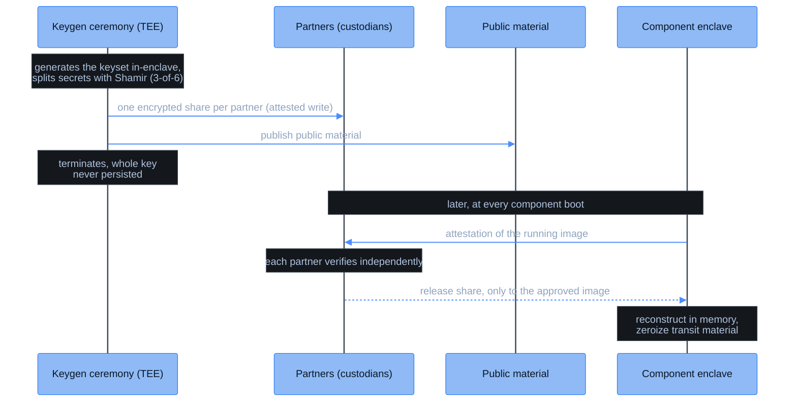

CoFHE's security rests on a small set of keys, and none of them is ever held whole by any person or machine outside an attested enclave.

| Key | Used by | Purpose |
|-----|---------|---------|
| FHE network key | [Teecryptor](/deep-dive/cofhe-components/teecryptor) | Decrypts ciphertexts inside the enclave |
| Result-signing key | Teecryptor | Signs decrypt results the TaskManager verifies onchain |
| Verifier signing key | [ZK Verifier](/deep-dive/cofhe-components/zk-verifier) | Signs verified input batches |
| Public material | Everyone | The network public key and CRS that clients encrypt against |

## The ceremony

The keys are born inside a TEE. A one-shot key-generation component runs in its own hardware-attested enclave and generates the network keyset there. The secret material is split with Shamir secret sharing into six shares; any three reconstruct it (3-of-6).

Each share goes to one **partner**: an independent custodian with its own share store. A partner's store accepts writes only from the attested ceremony image, so nobody can slip in a substitute share. The public material is published for clients. The ceremony enclave then terminates; the assembled key is never persisted anywhere.

## Custody

At rest, the key exists only as shares held by independent partners. No partner can reconstruct anything alone, and no quorum below the threshold can either. Fhenix operates the components, but it cannot assemble the key outside an attested enclave any more than anyone else can.

## Release at boot

When Teecryptor or the ZK Verifier starts, the TEE hardware produces an attestation of the exact code image it is running. Each partner independently verifies that attestation and releases its share only to the approved image digest. The enclave reconstructs the key in memory, zeroizes the transit material, and never persists it. Restarting the component repeats the whole handshake.

The guarantee this chain yields: from generation through every reconstruction, the key exists only inside hardware-attested enclaves running reviewed code.
