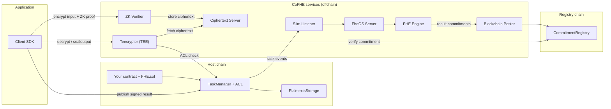

CoFHE (Coprocessor for Fully Homomorphic Encryption) lets smart contracts compute on encrypted data. Contracts request operations through onchain calls; a set of offchain services executes them and commits to the results. Data stays encrypted through the entire lifecycle, and every result can be verified against an onchain commitment.

## The onchain contracts

- **FHE.sol**: the Solidity library your contract imports. It exposes arithmetic, comparison, and logical operations on encrypted values, plus access control (`allow`, `allowGlobal`) and decrypt-result verification.
- **[TaskManager](/deep-dive/cofhe-components/task-manager)**: the gateway for all FHE operation requests. It validates requests, emits task events for the offchain services, and manages permissions through the [ACL](/deep-dive/cofhe-components/acl).
- **[PlaintextsStorage](/deep-dive/cofhe-components/plaintext-storage)**: stores decrypted results after they are published onchain with a verified Teecryptor signature.
- **[CommitmentRegistry](/deep-dive/cofhe-components/commitment-registry)**: lives on a dedicated registry chain and records a hash commitment for every ciphertext the coprocessor produces or verifies. Teecryptor checks it before decrypting anything.

## The offchain services

- **[Client SDK](/client-sdk/introduction/overview)** (`@cofhe/sdk`): the TypeScript library applications use to encrypt inputs, manage [permits](/client-sdk/guides/permits), and decrypt outputs.
- **[ZK Verifier](/deep-dive/cofhe-components/zk-verifier)**: verifies the zero-knowledge proof attached to every encrypted input, signs it, and stores the ciphertext bytes.
- **[Slim Listener](/deep-dive/cofhe-components/slim-listener)**: watches TaskManager events on each host chain and forwards them into the coprocessor's queues.
- **[FheOS Server](/deep-dive/cofhe-components/fheos-server)**: ingests task events, verifies inputs, creates result placeholders, and routes work to the FHE Engine. It does not execute FHE operations itself.
- **[FHE Engine](/deep-dive/cofhe-components/fheos-server)**: executes every FHE operation on encrypted data, persists the resulting ciphertexts, and emits a commitment for each result.
- **Ciphertext Server**: stores and serves ciphertext bytes to the other services.
- **Blockchain Poster**: batches result commitments and posts them to the CommitmentRegistry.
- **[Teecryptor](/deep-dive/cofhe-components/teecryptor)**: the decryption service. It runs inside a hardware-attested TEE, authorizes every request against the onchain ACL, verifies the ciphertext commitment, and returns signed or sealed results.

Services communicate through message queues rather than direct calls, so each stage can retry and scale independently.

## Data flows

1. **[Encryption request](/deep-dive/data-flows/encryption-request-flow)**: an input is encrypted client-side and proven valid with a zero-knowledge proof before it enters the chain.
2. **[FHE operation flow](/deep-dive/data-flows/fhe-operation-request-flow)**: a contract requests a computation; the coprocessor executes it and commits to the result.
3. **[Decryption request](/deep-dive/data-flows/decryption-request-flow)**: the SDK asks Teecryptor for a signed plaintext that can be published onchain.
4. **[Offchain decryption](/deep-dive/data-flows/off-chain-decryption-flow)**: the SDK receives the plaintext sealed to a permit, for reads that never touch the chain.

## What comes next

Decryption is currently performed by Teecryptor inside a hardware-attested TEE. A multi-party [Threshold Network](/deep-dive/research/future-plans) is the planned successor.
