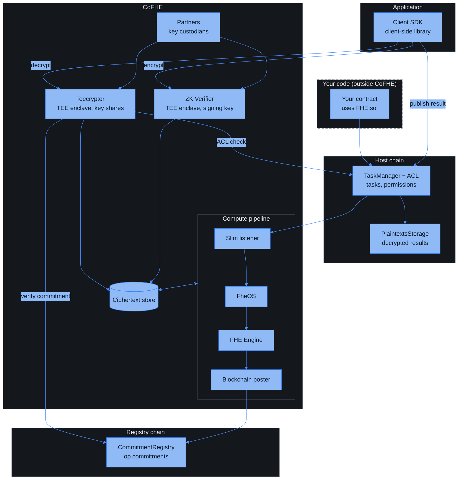

CoFHE (Coprocessor for Fully Homomorphic Encryption) lets smart contracts compute on encrypted data. Contracts request operations through onchain calls; a set of offchain components executes them and commits to the results. Data stays encrypted until an authorized decryption, and every result can be verified against an onchain commitment.

## The onchain contracts

- **FHE.sol**: the Solidity library your contract imports. It exposes arithmetic, comparison, and logical operations on encrypted values, plus access control (`allow`, `allowGlobal`) and decrypt-result verification.
- **[TaskManager](/deep-dive/cofhe-components/task-manager)**: the gateway for all FHE operation requests. It validates requests, emits task events for the offchain components, and manages permissions through the ACL.
- **[ACL](/deep-dive/cofhe-components/acl)**: the access control contract. It records who may use or decrypt each handle; all writes to it go through the TaskManager.
- **[PlaintextsStorage](/deep-dive/cofhe-components/plaintext-storage)**: stores decrypted results. The TaskManager writes them during `publishDecryptResult`, only after ECDSA-verifying the result against `decryptResultSigner`.
- **[CommitmentRegistry](/deep-dive/cofhe-components/commitment-registry)**: lives on a dedicated registry chain and records a hash commitment for every ciphertext the coprocessor produces or verifies. Teecryptor verifies integrity against it before decrypting anything.

## The offchain components

- **[Client SDK](/client-sdk/introduction/overview)** (`@cofhe/sdk`): the TypeScript library applications use to encrypt inputs, manage [permits](/client-sdk/guides/permits), and decrypt outputs.
- **[ZK Verifier](/deep-dive/cofhe-components/zk-verifier)**: verifies encrypted inputs in batches, inside a hardware-attested TEE. It checks each zero-knowledge proof, stores the ciphertexts, and signs one approval for the whole batch.
- **[Compute pipeline](/deep-dive/cofhe-components/compute-pipeline)**: four offchain components in a line, the slim listener, FheOS, the FHE Engine, and the blockchain poster. Together they subscribe to TaskManager events, validate and order operations, run them on encrypted data, and post a commitment for every result.
- **Ciphertext store**: the database that holds every ciphertext, fronted by the CT Server. The ZK Verifier writes verified inputs, the FHE Engine reads operands and writes results, and Teecryptor fetches bytes to decrypt.
- **[Teecryptor](/deep-dive/cofhe-components/teecryptor)**: the decryption component. It runs inside a hardware-attested TEE, authorizes every request against the onchain ACL, verifies the ciphertext commitment, and returns signed or sealed results.
- **Partners**: independent custodians of the key material. Each holds a Shamir share and releases it only to an attested enclave. See [Key Management](/deep-dive/cofhe-components/key-management).

## Data flows

1. **[Encryption request](/deep-dive/data-flows/encryption-request-flow)**: an input is encrypted client-side and proven valid with a zero-knowledge proof before it enters the chain.
2. **[FHE operation](/deep-dive/data-flows/fhe-operation-request-flow)**: a contract requests a computation; the coprocessor executes it and commits to the result.
3. **[Decryption](/deep-dive/data-flows/decryption-request-flow)**: the SDK asks Teecryptor to decrypt a handle, either as a signed plaintext for onchain publication or sealed to a permit for offchain reads.

## Future plans

Two components run inside hardware-attested TEEs today: Teecryptor, which decrypts, and the ZK Verifier, which checks input proofs. Both move to multi-party computation in one planned step. See [Future Plans](/deep-dive/research/future-plans).
