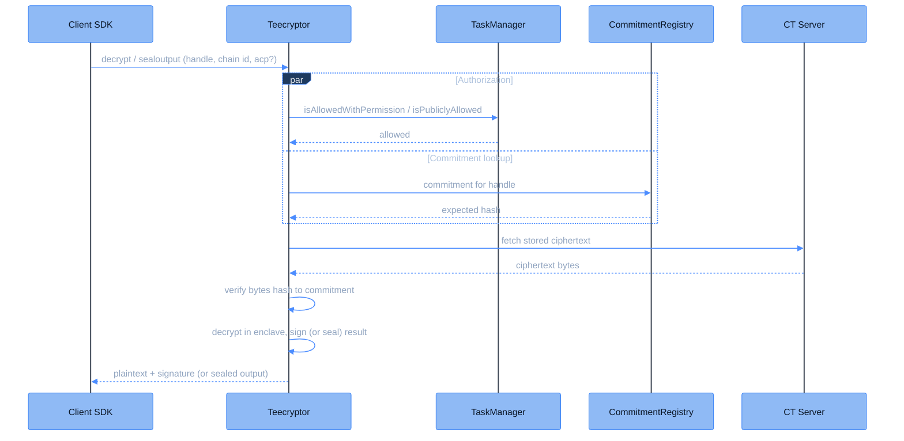

| Aspect | Description |
| -------------------- | ------------------------------------------------------------------------------------------------------------------------------------------------------------------------------------------------ |
| **Type** | Offchain service running inside a hardware-attested Trusted Execution Environment (TEE). |
| **Function** | Process decryption requests from the [Client SDK](/client-sdk/introduction/overview). |
| **Responsibilities** | • Authorizes each request against the onchain ACL • Verifies the ciphertext against its onchain commitment • Decrypts inside the enclave • Signs (or seals) the result for delivery |

Teecryptor is the component that decrypts CoFHE ciphertexts. It holds the FHE secret key, but only inside a TEE: an isolated, hardware-encrypted execution environment (Intel TDX) whose exact code image is proven by remote attestation. The trust model is deliberate and worth stating plainly. Instead of splitting the decryption computation across independent parties, Teecryptor relies on hardware attestation to guarantee that only one specific, reviewable program can ever touch the key. A [Threshold Network](/deep-dive/research/future-plans) that decrypts through multi-party computation is the planned next step and will eventually replace Teecryptor.

## How a decrypt request is processed

Every `decrypt` and `sealoutput` request carries a ciphertext handle, a host chain id, and optionally a [permit](/client-sdk/guides/permits), sent on the wire as an `acp` (Access Control Permission). A `sealoutput` request requires one, since the ACP carries the sealing key. Teecryptor then runs a fixed pipeline:

<Steps>

<Step title="Authorization">
Teecryptor checks the handle against the onchain ACL through the [TaskManager](/deep-dive/cofhe-components/task-manager) on the requested host chain. With a permit, the contract verifies the permit's EIP-712 signature and calls `isAllowedWithPermission`. Without a permit, the handle must have been marked publicly decryptable, checked via `isPubliclyAllowed`. Both paths fail closed: no onchain allowance, no decryption.
</Step>

<Step title="Commitment verification">
Concurrently with authorization, Teecryptor confirms that the [FHE Engine](/deep-dive/cofhe-components/fhe-engine) posted a commitment for this handle in the [CommitmentRegistry](/deep-dive/cofhe-components/commitment-registry). Commitments are write-once, so a verified result is cached permanently.
</Step>

<Step title="Ciphertext fetch and integrity check">
The ciphertext is fetched from the CT Server exactly as the FHE Engine stored it, and its bytes must hash to the onchain commitment. A missing commitment or mismatched bytes rejects the request. Teecryptor only ever decrypts bytes the coprocessor committed to publicly.
</Step>

<Step title="Decryption">
The enclave decrypts the stored bytes with the FHE secret key, exactly as they were committed. The bytes that were hashed are the bytes that get decrypted, so the integrity check stays meaningful.
</Step>

<Step title="Signing or sealing">
For `decrypt` (the `decryptForTx` path), the plaintext is signed with an ECDSA key that never leaves the enclave, producing a result any contract can verify onchain. For `sealoutput` (the `decryptForView` path), the plaintext is instead encrypted to the permit's sealing key using NaCl `crypto_box` (X25519 with XSalsa20-Poly1305). Only the permit holder can read it, and the SDK unseals it locally.
</Step>

</Steps>

<Note>
A handle whose ciphertext or commitment has not landed yet is not an error. Teecryptor answers with a retryable status and the SDK re-submits automatically, roughly once per second within a multi-minute budget.
</Note>

## Attestation

Remote attestation is what turns "trust the operator" into "verify the code". Before Teecryptor can obtain any key material, the TEE hardware produces an attestation of the exact code image it is running. Each key-share custodian independently checks that attestation and releases its share only to the approved image digest. The guarantee this yields: the FHE key can only be reconstructed by the exact reviewed code, running on genuine TEE hardware. Nothing else, including the infrastructure operator, can obtain the key or observe the enclave's memory, which the hardware keeps encrypted.

## Key custody

The FHE secret key is never stored whole. It is split with Shamir secret sharing into six shares held by independent parties, with any three required for reconstruction (3-of-6). At boot, the attested enclave collects shares from the custodians, reconstructs the key in memory, and zeroizes the transient share material. The reconstructed key exists only inside the enclave for the lifetime of the process. It is never persisted. The result-signing key travels inside the same split secret, so it too can only materialize inside the attested enclave. See [Key Management](/deep-dive/cofhe-components/key-management) for the ceremony that creates and distributes the shares.

## Result signing

Every `decrypt` result is signed so the TaskManager can verify it onchain. Teecryptor builds a fixed 76-byte message and signs its keccak256 hash with secp256k1:

| Field | Size | Encoding |
|-------|------|----------|
| `result` | 32 bytes | uint256, big-endian, left-padded with zeros |
| `enc_type` | 4 bytes | i32, big-endian |
| `chain_id` | 8 bytes | u64, big-endian |
| `ct_hash` | 32 bytes | uint256, big-endian |

This layout matches what the TaskManager reconstructs in `_computeDecryptResultHash`, so `FHE.publishDecryptResult(ctHash, result, signature)` verifies the signature onchain before storing the plaintext. Request the signature with the `X-Signature-V-Format: evm` header (the SDK does this for you) so the recovery id is 27/28 and directly compatible with Solidity's `ecrecover`.

Teecryptor's signer address is registered onchain as `decryptResultSigner` in the TaskManager. Only results signed by that address are accepted.

## Future plans

Teecryptor concentrates key custody at runtime in a single attested machine. The planned Threshold Network removes that concentration by decrypting through multi-party computation, where no party ever holds the full key. See [Future Plans](/deep-dive/research/future-plans).
