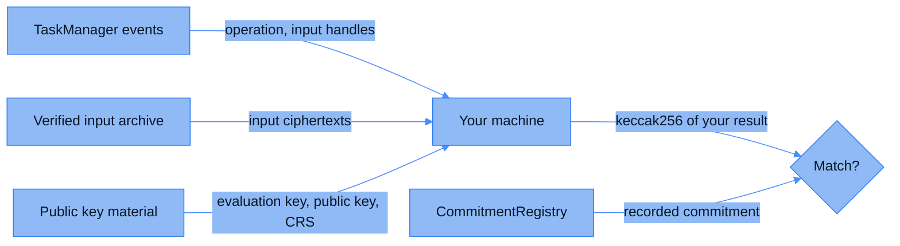

Every ciphertext CoFHE produces or verifies is anchored by a hash commitment. This page shows you how to check one without trusting the coprocessor: read the public inputs, run the same computation yourself, and compare your hash to the recorded one. Nothing here needs an account, a key, or permission from anyone.

## What the check proves

A commitment is `keccak256` over a ciphertext's stored bytes. Those bytes are deterministic. The same inputs, the same keys, and the same FHE parameters produce the same ciphertext, byte for byte, on your machine as on ours.

So the audit is a recomputation:

1. Read the operation and its input handles from the host chain.
2. Fetch the input ciphertexts from the public archive.
3. Fetch the public key material the network computes with.
4. Re-run the operation with those inputs.
5. Hash your result and compare it to the recorded commitment.

A match means the coprocessor ran the operation the contract asked for, and did not substitute a result. A mismatch means it did not.

The check says nothing about plaintexts. You never learn what any value decrypts to, because you never hold a decryption key. That is the point: the computation is auditable while the data stays confidential.

## What you need

| Item | Value |
| --- | --- |
| TaskManager | `0xeA30c4B8b44078Bbf8a6ef5b9f1eC1626C7848D9`, the same address on every supported chain |
| Host chain RPC | Any endpoint for the chain your contract runs on |
| CommitmentRegistry | Address pending, see [Pending values](#pending-values) |
| Verified input archive | Base URL pending |
| Public key material | Base URL pending, plus `GetNetworkPublicKey` and `GetCrs` for the two artifacts served over HTTP |
| tfhe-rs | `1.5.1` |
| Tools | Foundry's `cast`, and a Rust toolchain for the recomputation |

### Pending values

Three values are not published yet. Everything else on this page works today.

| Value | Why it is missing |
| --- | --- |
| CommitmentRegistry address | The registry chain is not fixed yet. The contract, its interface, and the version tag are settled; only the deployment target is open. |
| Verified input archive base URL | The archive exists and its object layout is stable. The public read endpoint is not published yet. |
| Public key material base URL | Same archive question. The public key and the CRS are already reachable over HTTP; the evaluation key is not. |

<Note>
Step 1 works today and does not depend on any of the three. The computation graph and every input commitment come from the host chain alone.
</Note>

## How a ciphertext is committed

Every ciphertext in CoFHE, whether an encrypted input or a computed result, is stored in one format: the tfhe-rs value, compressed with `compress()`, then written with tfhe's `safe_serialize`. The commitment is `keccak256` over exactly those bytes. The security zone is not in the preimage.

A handle is not the commitment, and the two relate differently depending on where the ciphertext came from.

| Ciphertext | Handle | Where its commitment lives |
| --- | --- | --- |
| Encrypted input | The commitment with its last two bytes replaced by metadata: byte 30 carries the type, byte 31 carries the security zone | `InputVerified` on the host chain, and the registry |
| Computed result | A placeholder the TaskManager derives from the operation and its inputs, before the result exists | The registry only |

That difference is why the registry exists. A result's handle is fixed onchain the moment the task is created, so it cannot carry a hash of bytes nobody has computed yet.



## Read the computation graph

The TaskManager publishes every operation it schedules. `TaskCreated` carries the result handle, the operation name, and up to three input handles.

```bash
RPC=https://arbitrum-sepolia-rpc.publicnode.com
TASK_MANAGER=0xeA30c4B8b44078Bbf8a6ef5b9f1eC1626C7848D9
LATEST=$(cast block-number --rpc-url $RPC)

cast logs --rpc-url $RPC --address $TASK_MANAGER \
  --from-block $((LATEST - 40000)) --to-block $LATEST \
  "TaskCreated(uint256 ctHash, string operation, uint256 input1, uint256 input2, uint256 input3)"
```

One real event from Arbitrum Sepolia, decoded:

| Field | Value |
| --- | --- |
| `operation` | `add` |
| `input1` | `0x4e6570aadde2d096ceb8214bcb54cc0aac9fa1af1d6640e9cae40052a23c0500` |
| `input2` | `0x4765f9b1760b9612da755387f067d04051c2821bb4defc33ba58cbf940f00500` |
| `ctHash` | `0xf0a73bae25878afcc52cf176616b3e3aa93f3ef6fa701ed61282cdd17df70500` |

Operation names come from `Utils.functionIdToString` in [`ICofhe.sol`](https://github.com/FhenixProtocol/cofhe-contracts/blob/master/contracts/ICofhe.sol), which also defines the type constants you need to read byte 30. Here every handle ends in `05 00`, which is `EUINT64_TFHE` in security zone 0.

An input handle is either another task's result, in which case you follow it and recurse, or an encrypted input. Encrypted inputs terminate the graph, and each one has its commitment onchain:

```bash
cast logs --rpc-url $RPC --address $TASK_MANAGER \
  --from-block $((LATEST - 40000)) --to-block $LATEST \
  "InputVerified(uint256 indexed ctHash, bytes32 commitment)"
```

The indexed topic is the handle, and the data word is the commitment. From a real event, unrelated to the task above:

```text
handle      0x1b2cd55ff9b0cbef294dfdc4cfb80ea6450bf0a272e45f9b3715a27bed350500
commitment  0x1b2cd55ff9b0cbef294dfdc4cfb80ea6450bf0a272e45f9b3715a27bed35c582
```

The first 30 bytes are identical, and the handle's last two are the type and the zone. That relation is worth checking as you go, because it catches a mistyped handle before you spend a recomputation on it.

## Read the commitment

`getCommitment` takes the version tag and the handle, and returns the recorded hash. `bytes32(0)` means nothing is posted for that pair.

```bash
REGISTRY=<pending>
REGISTRY_RPC=<pending>
VERSION=0x0000000000000000000000000000000000000000000000000000000000000002
HANDLE=0xf0a73bae25878afcc52cf176616b3e3aa93f3ef6fa701ed61282cdd17df70500

cast call $REGISTRY "getCommitment(bytes32,bytes32)(bytes32)" \
  $VERSION $HANDLE --rpc-url $REGISTRY_RPC
```

<Warning>
The version tag is the number 2 encoded as `bytes32`, so `0x00...02`. It is not the ASCII character `2`. `cast format-bytes32-string "2"` returns `0x3200...00`, and every lookup under that value comes back zero.
</Warning>

A zero answer is not proof of tampering. A result that is still being computed has no commitment yet, because the coprocessor posts the commitment after the compute stage finishes.

To audit in bulk rather than one handle at a time, enumerate the version. `getSize` reports the total, and `getHandles` pages through it, clamping `offset + limit` at the total and returning an empty array once `offset` runs past the end.

```bash
cast call $REGISTRY "getSize(bytes32)(uint256)" $VERSION --rpc-url $REGISTRY_RPC

cast call $REGISTRY "getHandles(bytes32,uint256,uint256)(bytes32[])" \
  $VERSION 0 100 --rpc-url $REGISTRY_RPC
```

Keep `limit` small. See [CommitmentRegistry](/deep-dive/cofhe-components/commitment-registry) for the write rules, the version state machine, and the rest of the read surface.

## Fetch the inputs

The [ZK Verifier](/deep-dive/cofhe-components/zk-verifier) archives every input it verifies, together with the proof that covered it. Objects are laid out by chain and security zone, sharded by the first four hex characters of the handle:

```text
cofhe/v1/chain/{chainId}/security-zone/{zone}/verified-inputs/{shard}/{handle}
cofhe/v1/chain/{chainId}/security-zone/{zone}/verification-proofs/{shard}/{proofId}
```

The handle is written without its `0x` prefix, and `{shard}` is its first four characters. For the verified input above, on Arbitrum Sepolia in zone 0, that is `cofhe/v1/chain/421614/security-zone/0/verified-inputs/1b2c/1b2cd55ff9b0cbef294dfdc4cfb80ea6450bf0a272e45f9b3715a27bed350500`.

Each object is a bincode-encoded record holding the ciphertext bytes and its metadata. The metadata carries the handle, the proof it belongs to, the submitting account, the security zone, the chain, the index within the proof, and the type. Take the ciphertext bytes out of that record. They are the same `safe_serialize` of a compressed value as everything else, so `keccak256` over them reproduces the commitment you read from `InputVerified`. Check that before going further.

The metadata also gives you the proof id, which is where you find the matching object under `verification-proofs`. Verifying that proof is a separate check, and it tells you the input was well formed rather than that the computation was honest.

## Fetch the public key material

Recomputation needs three artifacts, all public and all specific to a security zone.

| Artifact | tfhe-rs type | Where |
| --- | --- | --- |
| Evaluation key | `CompressedServerKey` | `keys/versionized/{zone}/computation_key` in the archive |
| Network public key | `CompactPublicKey` | `keys/versionized/{zone}/public_key`, or `GetNetworkPublicKey` |
| CRS | `CompactPkeCrs` | `keys/versionized/{zone}/crs`, or `GetCrs` |

A manifest sits alongside them at `keys/versionized/{zone}/public-material`, carrying a SHA-256 digest of each artifact. Check the artifacts you downloaded against it.

Two of the three are also served over HTTP by the coprocessor, at the CoFHE URL your chain's SDK config already holds. Both take a security zone and return hex:

```bash
COFHE_URL=$(node -e "import('@cofhe/sdk/chains').then(c => console.log(c.arbSepolia.coFheUrl))")

curl -s -X POST $COFHE_URL/GetNetworkPublicKey \
  -H 'Content-Type: application/json' \
  -d '{"securityZone": 0}' | jq -r .publicKey | head -c 64

curl -s -X POST $COFHE_URL/GetCrs \
  -H 'Content-Type: application/json' \
  -d '{"securityZone": 0}' | jq -r .crs | head -c 64
```

<Note>
Neither HTTP endpoint serves the evaluation key, and you cannot compute without it. Only the archive has it. Until that base URL is published, this is the step that blocks a full recomputation.
</Note>

## Re-run the operation

Start from a crate that pins tfhe-rs to the version the network runs:

```toml Cargo.toml
[dependencies]
tfhe = { version = "=1.5.1", features = ["shortint", "integer", "boolean", "zk-pok"] }
tiny-keccak = { version = "2.0", features = ["keccak"] }
hex = "0.4"
```

<Warning>
A fresh resolve picks `tfhe-zk-pok` 0.8.3, which pulls a `tfhe-versionable` that tfhe 1.5.1 does not build against. The build fails inside tfhe itself with over a hundred trait-bound errors. Pin it back with `cargo update -p tfhe-zk-pok --precise 0.8.0`.
</Warning>

Then decompress the evaluation key, deserialize both inputs, apply the operation the event named, and serialize the result the way the coprocessor does:

```rust src/main.rs
use tfhe::safe_serialization::{safe_deserialize, safe_serialize};
use tfhe::{CompressedFheUint64, CompressedServerKey};
use tiny_keccak::{Hasher, Keccak};

const SIZE_LIMIT: u64 = 1 << 32;

fn recompute_add(computation_key: &[u8], input1: &[u8], input2: &[u8]) -> Result<[u8; 32], String> {
    let server_key: CompressedServerKey = safe_deserialize(computation_key, SIZE_LIMIT)?;
    tfhe::set_server_key(server_key.decompress());

    let lhs: CompressedFheUint64 = safe_deserialize(input1, SIZE_LIMIT)?;
    let rhs: CompressedFheUint64 = safe_deserialize(input2, SIZE_LIMIT)?;

    let result = lhs.decompress() + rhs.decompress();

    // The coprocessor commits to the compressed, safe-serialized form. Any other
    // encoding of the same ciphertext hashes to something else.
    let mut stored = Vec::new();
    safe_serialize(&result.compress(), &mut stored, SIZE_LIMIT).map_err(|e| e.to_string())?;

    let mut hasher = Keccak::v256();
    hasher.update(&stored);
    let mut commitment = [0u8; 32];
    hasher.finalize(&mut commitment);
    Ok(commitment)
}
```

Compression is deterministic. It is a modulus switch whose noise-reduction step picks its candidate by a fixed measure, with no randomness. The same inputs give the same bytes on every run and every machine.

If the value this returns equals what `getCommitment` gave you for the result handle, the coprocessor computed honestly for that task. Walk the graph up from the encrypted inputs and you have checked the whole computation.

### Parameters the keyset uses

You do not need these to recompute, because the evaluation key carries them. They are here so you can confirm the keyset you downloaded is the one you expect:

| Role | tfhe-rs parameter set |
| --- | --- |
| Compute keys | `PARAM_MESSAGE_2_CARRY_2_KS_PBS` |
| Compact public key | <code style={{ whiteSpace: "nowrap" }}>V0_11_PARAM_PKE_MESSAGE_2_CARRY_2_KS_PBS_TUNIFORM_2M64</code> |
| Key switching | <code style={{ whiteSpace: "nowrap" }}>V0_11_PARAM_KEYSWITCH_MESSAGE_2_CARRY_2_KS_PBS_TUNIFORM_2M64</code> |

## Where this check runs in production

[Teecryptor](/deep-dive/cofhe-components/teecryptor) makes the same comparison inside its enclave on every decryption request. It hashes the ciphertext bytes it is about to decrypt and refuses any that do not match the commitment anchored onchain. Your audit and its gate read the same record.

## Source

- [`CommitmentRegistry.sol`](https://github.com/FhenixProtocol/cofhe-contracts/blob/master/contracts/internal/registry-chain/contracts/commitment-registry/CommitmentRegistry.sol), the registry contract.
- [`TaskManager.sol`](https://github.com/FhenixProtocol/cofhe-contracts/blob/master/contracts/internal/host-chain/contracts/TaskManager.sol), which emits `TaskCreated` and `InputVerified`.
- [`ICofhe.sol`](https://github.com/FhenixProtocol/cofhe-contracts/blob/master/contracts/ICofhe.sol), for operation names and type constants.
