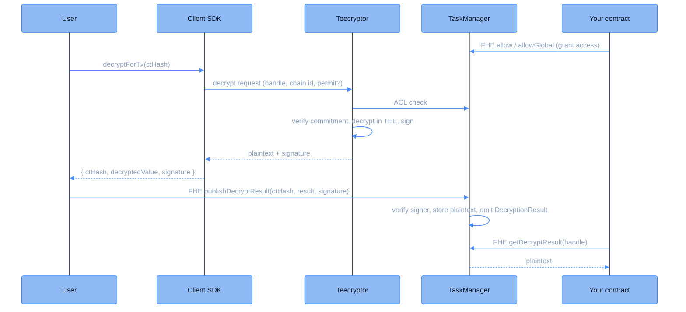

This page follows a plaintext all the way onto the chain: from the SDK's `decryptForTx` call, through [Teecryptor](/deep-dive/cofhe-components/teecryptor), to a signed result the TaskManager verifies and any contract can read.

<Note>
**Contracts cannot request decryption onchain.** The TaskManager rejects decrypt tasks (`DecryptFunctionNotSupported`), and `FHE.decrypt` no longer exists in the FHE library. Decryption is exclusively SDK-driven. A contract's role is to grant access (`FHE.allow`, `FHE.allowGlobal`, or `TaskManager.allowForDecryption`) and later read the published result. This design keeps decryption off the transaction path. The coprocessor never pushes plaintexts into your contract; anyone holding a valid signature publishes the result, and the contract verifies that signature itself.
</Note>

There are two SDK entry points:

- **`decryptForTx`**: returns the plaintext with a signature you can publish onchain. This page covers it.
- **`decryptForView`**: returns a sealed result only the permit holder can read, for UI display. Covered in the [Offchain Decryption Flow](/deep-dive/data-flows/off-chain-decryption-flow).

## Step-by-step flow

<Steps>

<Step title="Contract grants access">
The contract that owns the encrypted value marks the handle decryptable: `FHE.allow(handle, account)` for a specific account, or `FHE.allowGlobal(handle)` when the value may become public. Without an ACL grant, Teecryptor refuses the request.
</Step>

<Step title="SDK request">
The user calls `decryptForTx` with the ciphertext handle:

```typescript
const { ctHash, decryptedValue, signature } = await client
  .decryptForTx(ctHash)
  .withPermit()
  .execute();
```

The request goes to Teecryptor with the handle, the host chain id, and the [permit](/client-sdk/guides/permits). For publicly decryptable handles, use `.withoutPermit()`.
</Step>

<Step title="Teecryptor verifies and decrypts">
Teecryptor authorizes the request against the onchain ACL, fetches the ciphertext exactly as stored, verifies it against the onchain commitment, and decrypts it inside the attested TEE. If the ciphertext or its commitment has not landed yet (a freshly computed handle), the SDK retries automatically until it is available.

See the [Teecryptor page](/deep-dive/cofhe-components/teecryptor) for the full pipeline.
</Step>

<Step title="Signed result">
Teecryptor returns the plaintext together with an ECDSA signature over a fixed 76-byte message (result, encryption type, chain id, ciphertext hash). The signing key lives only inside the enclave, and its address is registered onchain as the TaskManager's `decryptResultSigner`.
</Step>

<Step title="Publication onchain">
Anyone holding the signature submits it in a transaction:

```solidity
FHE.publishDecryptResult(ctHash, result, signature);
```

The TaskManager recomputes the message hash, recovers the signer, and rejects anything not signed by `decryptResultSigner`. On success it stores the plaintext in PlaintextsStorage and emits a `DecryptionResult` event. `publishDecryptResultBatch` amortizes gas across multiple results.

<Note>
Publication is permissionless: any relayer with a valid signature can deliver the result. `decryptForTx` itself costs no gas; gas is paid only by this publish transaction.
</Note>
</Step>

<Step title="Contract read-back">
Once published, any contract reads the plaintext:

```solidity
uint64 value = FHE.getDecryptResult(handle);                     // reverts if not yet published
(uint64 value, bool ready) = FHE.getDecryptResultSafe(handle);   // non-reverting variant
```

To check a signature without storing the result, use the `verifyDecryptResult` family on the TaskManager.
</Step>

</Steps>

## Flow diagram



## Future plans

Decryption is currently performed by Teecryptor inside a hardware-attested TEE. A multi-party Threshold Network is the planned successor; see [Future Plans](/deep-dive/research/future-plans).
