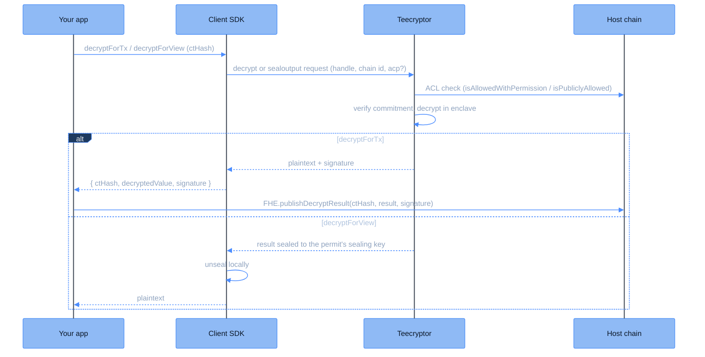

Decryption in CoFHE is SDK-driven and happens offchain, inside [Teecryptor](/deep-dive/cofhe-components/teecryptor). A contract's role is to grant access and, when the result should go onchain, to read it back after publication.

<Note>
**Contracts cannot request decryption onchain.** The TaskManager rejects decrypt tasks (`DecryptFunctionNotSupported`), and `FHE.decrypt` no longer exists in the FHE library. The coprocessor never pushes plaintexts into your contract.
</Note>

There are two SDK entry points, one per destination:

- **`decryptForTx`**: returns the plaintext with a Teecryptor signature you can publish onchain. Guide: [Decrypt to Tx](/client-sdk/guides/decrypt-to-tx).
- **`decryptForView`**: returns the plaintext sealed to your [permit](/client-sdk/guides/permits) (an ACP, Access Control Permission, onchain), for UI display and offchain reads. Guide: [Decrypt to View](/client-sdk/guides/decrypt-to-view).

<Note>
A freshly computed handle may not be decryptable immediately: its ciphertext and commitment land shortly after the transaction. Until then Teecryptor answers with a retryable status and the SDK re-submits automatically.
</Note>

## The shared pipeline

Both entry points start the same way.

<Steps>

<Step title="Contract grants access">
The contract that owns the encrypted value marks the handle decryptable: `FHE.allow(handle, account)` for a specific account, or `FHE.allowGlobal(handle)` when the value may become public. Without an ACL grant, Teecryptor refuses the request.
</Step>

<Step title="SDK request">
The application calls one of the two builders:

```typescript
const { ctHash, decryptedValue, signature } = await client
  .decryptForTx(ctHash)
  .withPermit()
  .execute();
```

```typescript
const balance = await client
  .decryptForView(ctHash, FheTypes.Uint32)
  .withPermit()
  .execute();
```

The request goes to Teecryptor with the handle, the host chain id, and the permit. For publicly decryptable handles, `decryptForTx` can use `.withoutPermit()` instead.
</Step>

<Step title="Teecryptor verifies and decrypts">
Teecryptor authorizes the request against the onchain ACL, fetches the ciphertext exactly as stored, verifies it against the onchain commitment, and decrypts it inside the attested enclave. See the [Teecryptor page](/deep-dive/cofhe-components/teecryptor) for the full pipeline.
</Step>

</Steps>

From here the two paths diverge.

## The transaction path

For `decryptForTx`, Teecryptor returns the plaintext together with an ECDSA signature over a fixed 76-byte message (result, encryption type, chain id, ciphertext hash). The signing key lives only inside the enclave, and its address is registered onchain as the TaskManager's `decryptResultSigner`.

Anyone holding the signature submits it in a transaction:

```solidity
FHE.publishDecryptResult(ctHash, result, signature);
```

The TaskManager recomputes the message hash, recovers the signer, and rejects anything not signed by `decryptResultSigner`. On success it stores the plaintext in PlaintextsStorage and emits a `DecryptionResult` event. `publishDecryptResultBatch` amortizes gas across multiple results.

<Note>
Publication is permissionless: any relayer with a valid signature can deliver the result. `decryptForTx` itself costs no gas; gas is paid only by this publish transaction.
</Note>

Once published, any contract reads the plaintext:

```solidity
uint64 value = FHE.getDecryptResult(handle);                     // reverts if not yet published
(uint64 value, bool ready) = FHE.getDecryptResultSafe(handle);   // non-reverting variant
```

To check a signature without storing the result, use the `verifyDecryptResult` family on the TaskManager.

## The view path

For `decryptForView`, Teecryptor never returns a bare plaintext. It encrypts the result to the permit's sealing key, and the SDK unseals it locally, so the plaintext is not exposed in transit. There is nothing to publish; the value goes straight to your application.

## Flow diagram



## Comparison

| | `decryptForTx` | `decryptForView` |
|---|---|---|
| **Returns** | Plaintext + Teecryptor signature | Plaintext (sealed in transit, unsealed by the SDK) |
| **Use case** | Submit the decrypted value onchain | Display in a UI, offchain reads |
| **Requires permit** | Only if the handle is not publicly decryptable | Yes |
| **Onchain verification** | <code style={{ whiteSpace: "nowrap" }}>publishDecryptResult</code> or <code style={{ whiteSpace: "nowrap" }}>verifyDecryptResult</code> | Not applicable |
| **Gas cost** | None for the decryption itself; gas only for the publish transaction | None |

## Future plans

Decryption is currently performed by Teecryptor inside a hardware-attested TEE. A multi-party Threshold Network is the planned successor; see [Future Plans](/deep-dive/research/future-plans).
