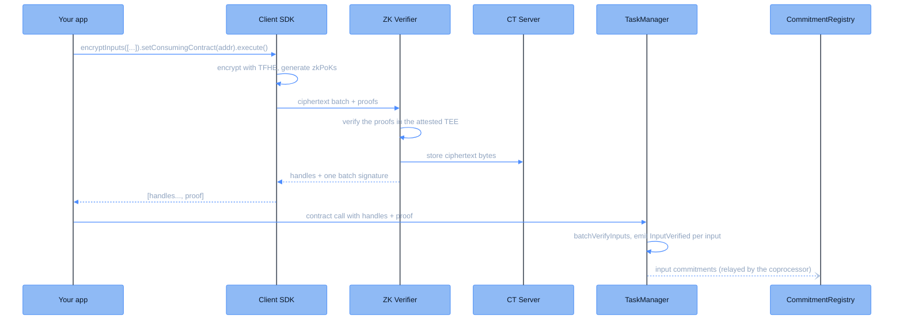

This page follows encrypted inputs from the plaintext in your application to handles a smart contract can compute on. Everything sensitive happens client-side: the values are encrypted and proven locally, and only the ciphertexts and their proofs ever leave the user's machine. Inputs travel as one batch, verified with a single signature that is bound to the contract that will consume them.

## Key components

| Component | Description |
|-----------|-------------|
| **dApp** | The application that interacts with the user and the contracts |
| **Client SDK** (`@cofhe/sdk`) | TypeScript library that encrypts inputs locally and submits them for verification |
| **ZK Verifier** | Attested offchain service that verifies the proofs of every encrypted-input batch |
| **CT Server** | Stores the verified ciphertext bytes for the coprocessor |
| **[TaskManager](/deep-dive/cofhe-components/task-manager)** | Verifies the ZK Verifier's batch signature when the inputs are used onchain |

## Flow diagram



## Step-by-step flow

<Steps>
<Step title="Install and initialize the Client SDK">
Install and initialize the Client SDK in your project. Full details are in the [installation guide](/client-sdk/introduction/installation).

```bash
npm install @cofhe/sdk
```

```javascript
const { Encryptable, FheTypes } = require("@cofhe/sdk");
const { createCofheConfig, createCofheClient } = require("@cofhe/sdk/node");
```
</Step>

<Step title="Encrypt and prove locally">
The application encrypts its values with a single builder call, naming the contract that will consume them:

```typescript
const [encryptedInput, proof] = await cofheClient
  .encryptInputs([Encryptable.uint32(42n)])
  .setConsumingContract(contractAddress)
  .execute();
```

Internally, `encryptInputs` encrypts each value with the TFHE library and generates a zkPoK (zero-knowledge proof of knowledge) that the encryption is correct. It then submits the whole batch to the ZK Verifier. The verifier's signature is bound to the consuming contract, so the batch cannot be replayed into a different one.
</Step>

<Step title="Verification and storage">
The ZK Verifier checks each proof inside its attested enclave. A valid proof shows the ciphertext is a correct, untampered encryption of a known plaintext. On success, the verifier stores the ciphertext bytes and returns the handles with one signature covering the batch. The SDK hands your application the tuple `[handles..., proof]`; each handle is an `external` encrypted value such as `externalEuint32`.
</Step>

<Step title="Use the encrypted input onchain">
The application passes the handles and the proof to the contract as encrypted inputs. When the contract consumes them, the TaskManager's `batchVerifyInputs` checks the ZK Verifier's signature over the batch and emits an `InputVerified` event per input. The coprocessor picks those events up and posts a commitment for each input to the CommitmentRegistry, so the ciphertexts are anchored onchain like every computed result.
</Step>
</Steps>

<Note>
Read more about the client-side API in [Encrypting Inputs](/client-sdk/guides/encrypting-inputs).
</Note>
