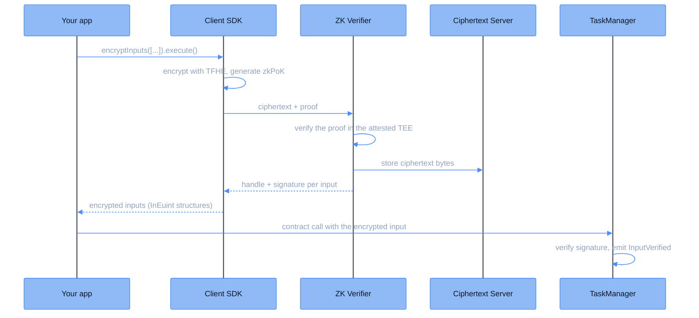

This page follows an encrypted input from the plaintext in your application to a handle a smart contract can compute on. Everything sensitive happens client-side: the value is encrypted and proven locally, and only the ciphertext and its proof ever leave the user's machine.

## Key components

| Component | Description |
|-----------|-------------|
| **dApp** | The application that interacts with the user and the contracts |
| **Client SDK** (`@cofhe/sdk`) | TypeScript library that encrypts inputs locally and submits them for verification |
| **ZK Verifier** | Attested offchain service that verifies the proof attached to every encrypted input |
| **Ciphertext Server** | Stores the verified ciphertext bytes for the coprocessor |
| **[TaskManager](/deep-dive/cofhe-components/task-manager)** | Verifies the ZK Verifier's signature when the input is used onchain |

## Flow diagram



## Step-by-step flow

<Steps>
<Step title="Install and initialize the Client SDK">
Install and initialize the Client SDK in your project. Full details are in the [installation guide](/client-sdk/introduction/installation).

```bash
npm install @cofhe/sdk
```

```javascript
const { Encryptable, FheTypes } = require("@cofhe/sdk");
const { createCofheConfig, createCofheClient } = require("@cofhe/sdk/node");
```
</Step>

<Step title="Encrypt and prove locally">
The application encrypts its values with a single builder call:

```typescript
const [encryptedInput] = await cofheClient
  .encryptInputs([Encryptable.uint32(42n)])
  .execute();
```

Internally, `encryptInputs` encrypts each value with the TFHE library and generates a zkPoK (zero-knowledge proof of knowledge) that the encryption is correct. It then submits the ciphertext and proof to the ZK Verifier.
</Step>

<Step title="Verification and storage">
The ZK Verifier checks the proof inside its attested enclave. A valid proof shows the ciphertext is a correct, untampered encryption of a known plaintext. On success, the verifier stores the ciphertext bytes and returns a handle and a signature per input. The SDK packages these into the `InEuint` structures your contract accepts.
</Step>

<Step title="Use the encrypted input onchain">
The application passes the `InEuint` structure to the contract as an encrypted input. When the contract consumes it, the TaskManager verifies the ZK Verifier's signature and emits an `InputVerified` event. The coprocessor picks that event up and posts a commitment for the input to the CommitmentRegistry, so the ciphertext is anchored onchain like every computed result.
</Step>
</Steps>

<Note>
Read more about the client-side API in [Encrypting Inputs](/client-sdk/guides/encrypting-inputs).
</Note>
