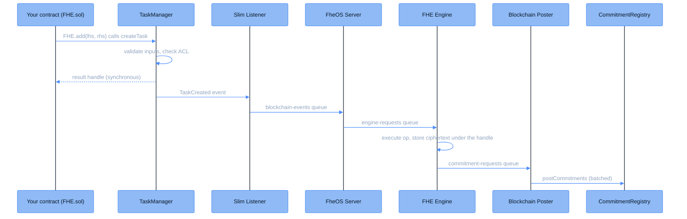

This page follows a single FHE operation from the contract call that requests it to the commitment that anchors its result onchain. The request itself is synchronous: the contract gets a handle for the result immediately, while the coprocessor computes the actual ciphertext in the background.

## Key components

| Component | Description |
|-----------|-------------|
| **Your contract** | Requests FHE operations through the FHE.sol library |
| **FHE.sol** | The Solidity library providing FHE operation functions |
| **[TaskManager](/deep-dive/cofhe-components/task-manager)** | Validates requests, checks the [ACL](/deep-dive/cofhe-components/acl), and emits task events |
| **[Slim Listener](/deep-dive/cofhe-components/slim-listener)** | Watches TaskManager events on each host chain and enqueues them |
| **[FheOS Server](/deep-dive/cofhe-components/fheos-server)** | Ingests task events, validates them, and routes work to the FHE Engine |
| **[FHE Engine](/deep-dive/cofhe-components/fhe-engine)** | Executes the FHE operation and stores the result ciphertext |
| **Blockchain Poster** | Batches result commitments and posts them onchain |
| **[CommitmentRegistry](/deep-dive/cofhe-components/commitment-registry)** | Records a hash commitment for every result ciphertext |

## Flow diagram



## Step-by-step flow

<Steps>
<Step title="Encrypt the input with the Client SDK">
The application encrypts its input client-side and proves it valid, producing an encrypted-input handle plus a batch proof the contract can accept. The [Encryption Request Flow](/deep-dive/data-flows/encryption-request-flow) covers this step.

<Note>
This step happens on the client side, before any blockchain interaction.
</Note>
</Step>

<Step title="Request an FHE operation">
Import the FHE library in Solidity:

```solidity
import "@fhenixprotocol/cofhe-contracts/FHE.sol";
```

Call the appropriate FHE function from the imported library:

```solidity
// Using trivial encrypt or the handle and proof from the previous step.
function addExample(externalEuint32 input, bytes calldata proof) public {
    euint32 lhs = FHE.asEuint32(input, proof);
    euint32 rhs = FHE.asEuint32(10);

    // Request an operation (addition in this example)
    euint32 result = FHE.add(lhs, rhs);
}
```

FHE.sol forwards the request to the TaskManager contract.
</Step>

<Step title="TaskManager processing">
The TaskManager is the gateway for all FHE operation requests. It:

1. Validates the request structure, so all inputs are properly formatted.
2. Verifies access permissions: the caller must have ACL access to every encrypted input.
3. Generates a unique handle that will reference the future ciphertext result.
4. Returns the handle to the calling contract, synchronously. Subsequent operations can chain on it right away.
5. Emits a `TaskCreated` event with the operation details for the offchain services.
</Step>

<Step title="Slim Listener pickup">
One Slim Listener instance runs per host chain per flow. This flow's listener watches for `TaskCreated` events and publishes them to the coprocessor's `blockchain-events` queue.
</Step>

<Step title="FheOS Server routing">
The FheOS Server consumes `blockchain-events`, validates the task, and routes FHE operations to the `engine-requests` queue. It does not execute operations itself.
</Step>

<Step title="FHE Engine execution">
The FHE Engine consumes `engine-requests` and:

1. Executes the requested operation on the encrypted data.
2. Stores the result ciphertext in the coprocessor's store, keyed by the handle.
3. Releases any dependent operations that were deferred while waiting for this result.
4. Publishes a commitment for the result (the hash of the stored ciphertext bytes) to the `commitment-requests` queue.
</Step>

<Step title="Commitment posting">
The Blockchain Poster batches commitments and posts them to the CommitmentRegistry on the registry chain. The commitment anchors the result. Teecryptor will only decrypt ciphertext bytes that hash to a registered commitment.

At this point the operation cycle is complete, and the confidentiality of every encrypted value is preserved.
</Step>
</Steps>
