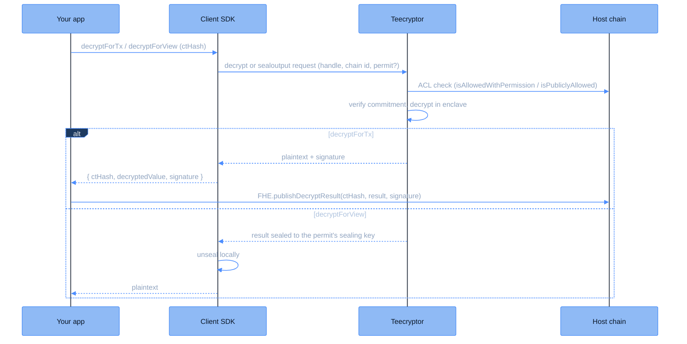

Decryption in CoFHE is SDK-driven. Contracts cannot request it onchain; instead, your application asks [Teecryptor](/deep-dive/cofhe-components/teecryptor) to decrypt a handle it is allowed to read. There are two methods:

- **`decryptForTx`**: returns the plaintext and a Teecryptor signature. Use it when the decrypted value needs to go onchain, via `FHE.publishDecryptResult` or the `verifyDecryptResult` family.
- **`decryptForView`**: returns the plaintext sealed to your permit. Use it for UI display or offchain reads where no onchain proof is needed.

<Note>
A freshly computed handle may not be decryptable immediately: its ciphertext and commitment land shortly after the transaction. Until then Teecryptor answers with a retryable status and the SDK re-submits automatically.
</Note>

## Key components

| Component | Description |
| --- | --- |
| **CtHash** | A `bytes32` handle representing an encrypted value, read from the chain. |
| **SDK client** | Client library handling [permits](/client-sdk/guides/permits) and the `decryptForTx` / `decryptForView` operations. |
| **Teecryptor** | Offchain decryption service running in an attested TEE. Verifies access onchain and returns signed or sealed results. |
| **ACL** | Onchain access control list that tracks who may decrypt each handle. |

## The `decryptForTx` flow

Use `decryptForTx` when you need to submit the decrypted value onchain with a proof.

<Steps>
<Step title="Fetch the CtHash">
Solidity contract:

```solidity
contract Example {
    euint32 public count;

    function setCount(uint32 num) public {
        count = FHE.asEuint32(num);
        FHE.allowThis(count);
        FHE.allowPublic(count); // Allow anyone to request decryption
    }
}
```

Fetch the `CtHash` from the chain:

```typescript
const ctHash = await example.count();
```

<Note>
All encrypted types (`euint8`, `euint16`, `euint32`, `euint64`, `euint128`, `ebool`, `eaddress`) are wrappers around `bytes32`. The data returned from the contract can be used as a `CtHash` directly.
</Note>
</Step>

<Step title="Request decryption">
Call `decryptForTx` on the SDK client. Since `FHE.allowPublic` was used, no permit is needed:

```typescript
const result = await client
  .decryptForTx(ctHash)
  .withoutPermit()
  .execute();
```

If the value was granted access via `FHE.allow` (not `allowPublic`), use `.withPermit()` instead:

```typescript
const result = await client
  .decryptForTx(ctHash)
  .withPermit()
  .execute();
```
</Step>

<Step title="Teecryptor verifies and decrypts">
Behind the scenes:

1. The SDK sends the request to Teecryptor with the handle, the host chain id, and the permit if one was attached.
2. Teecryptor checks the onchain ACL. With a permit it calls `isAllowedWithPermission` for the permit's issuer; without one, the handle must pass `isPubliclyAllowed`.
3. Teecryptor verifies the stored ciphertext against its onchain commitment and decrypts it inside the enclave.
4. Teecryptor signs the plaintext with its onchain-registered key and returns both the plaintext and the signature.
</Step>

<Step title="Submit onchain with proof">
The SDK returns an object containing the decrypted value and signature. Submit these onchain:

```typescript
// result contains: { ctHash, decryptedValue, signature }

await example.revealCount(
  result.decryptedValue,
  result.signature
);
```

The onchain function verifies the signature using `FHE.publishDecryptResult` or `FHE.verifyDecryptResult`:

```solidity
function revealCount(uint32 _decrypted, bytes memory _signature) external {
    FHE.publishDecryptResult(count, _decrypted, _signature);
}
```
</Step>
</Steps>

## The `decryptForView` flow

Use `decryptForView` when you only need to read the value offchain, for example to display it in a UI. No onchain transaction is involved.

<Steps>
<Step title="Fetch the CtHash">
The contract must have granted access to the user via `FHE.allow` or `FHE.allowSender`:

```solidity
contract Example {
    mapping(address => euint32) private balances;

    function getBalance() public view returns (euint32) {
        return balances[msg.sender];
    }

    function deposit(uint32 amount) public {
        balances[msg.sender] = FHE.asEuint32(amount);
        FHE.allowThis(balances[msg.sender]);
        FHE.allowSender(balances[msg.sender]); // Grant access to the user
    }
}
```

```typescript
const ctHash = await example.getBalance();
```
</Step>

<Step title="Request decryption">
Call `decryptForView` with a permit and the value's FHE type. The type tells the SDK how to decode the result:

```typescript
const balance = await client
  .decryptForView(ctHash, FheTypes.Uint32)
  .withPermit()
  .execute();

console.log(`Balance: ${balance}`);
```

`execute()` returns the decoded plaintext directly.
</Step>

<Step title="Teecryptor verifies, decrypts, and seals">
Behind the scenes:

1. The SDK sends the request with the user's permit.
2. Teecryptor verifies the permit's EIP-712 signature onchain and checks that the permit's issuer has access to the handle.
3. Teecryptor verifies the ciphertext commitment and decrypts inside the enclave, exactly as in the `decryptForTx` path.
4. Instead of a bare plaintext, Teecryptor returns the result encrypted to the permit's sealing key. The SDK unseals it locally, so the plaintext is never exposed in transit.
</Step>
</Steps>

## Flow diagram



## Comparison

| | `decryptForTx` | `decryptForView` |
|---|---|---|
| **Returns** | Plaintext + Teecryptor signature | Plaintext (sealed in transit, unsealed by the SDK) |
| **Use case** | Submit the decrypted value onchain | Display in a UI, offchain reads |
| **Requires permit** | Only if the handle is not publicly decryptable | Yes |
| **Onchain verification** | `publishDecryptResult` or `verifyDecryptResult` | Not applicable |
| **Gas cost** | None for the decryption itself; gas only for the publish transaction | None |
