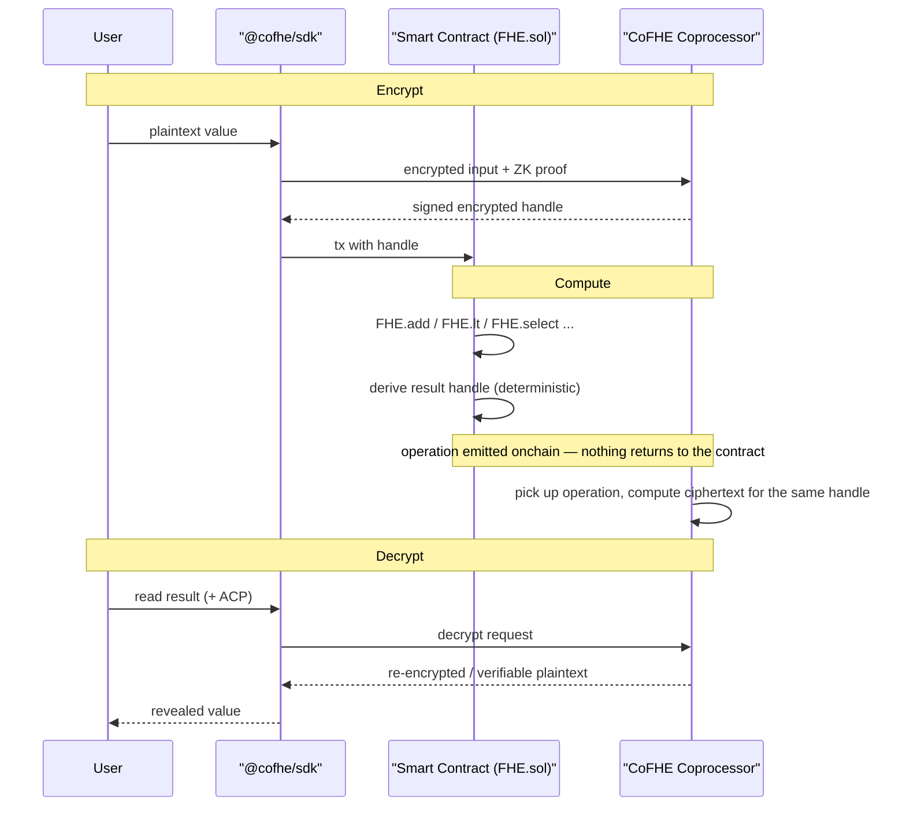

[FHE](/get-started/introduction/fhenix) explains *why* confidential smart contracts matter. **CoFHE is how Fhenix makes them practical.**

**CoFHE is an FHE coprocessor that lets any blockchain run computations on encrypted data.**

This makes confidentiality just another Solidity feature. There's no migration to a specialized FHE chain, no new toolchain, and no cryptography to implement yourself. CoFHE handles the heavy FHE math offchain; your contract only ever touches lightweight *handles* to encrypted values, so code stays familiar. Values are encrypted. Everything else feels like ordinary development.

## Why a coprocessor?

The coprocessor model adds confidentiality without changing how applications are built, same Solidity, same chains, same tooling, with encrypted values as just another type to work with.

- **No migration**: CoFHE attaches to existing blockchains. Confidential contracts deploy to the networks already in use, not a dedicated FHE L1.
- **Familiar code**: contracts pass around lightweight *handles* (references to ciphertexts) rather than the ciphertexts themselves, so they read like normal Solidity. FHE operations add some gas overhead, but the onchain footprint stays small and predictable.
- **No cryptography to implement**: the heavy FHE math runs offchain on the CoFHE server, which is built to do it efficiently. A contract calls `FHE.add`; CoFHE does the rest.
- **Trust-minimized by default**: decryption is never in one party's hands. A Threshold Network performs it through multi-party computation.

## What CoFHE lets you build

Because computation happens on encrypted values, you can build applications where sensitive data never appears in plaintext onchain:

- **Confidential balances and transfers**: token amounts and balances stay hidden while transfers still settle correctly.
- **Private state in contracts**: per-user values (counters, scores, bids, positions) that no one, not even the contract or CoFHE, can read in the clear.
- **Sealed inputs**: users submit encrypted inputs (votes, bids, orders) that are computed on without ever being revealed.
- **Selective disclosure**: results are decrypted only for authorized parties, gated by signed ACPs.

## How it works

Every CoFHE application follows the same three-phase lifecycle: **encrypt to compute to decrypt.**

<Steps>

<Step title="Encrypt (client-side)">
The user's plaintext is encrypted in the client using the [`@cofhe/sdk`](/client-sdk/introduction/overview), bundled with a zero-knowledge proof that the input is well-formed, and submitted to CoFHE. The blockchain only ever receives an encrypted handle, never the raw value.
</Step>

<Step title="Compute (onchain handle, offchain math)">
The smart contract uses [`FHE.sol`](/fhe-library/introduction/overview) to operate on encrypted handles, adding, comparing, selecting, as if they were ordinary numbers. Each operation deterministically derives a new result handle and is recorded onchain; the CoFHE server independently computes the matching ciphertext offchain. Nothing returns to the contract, and plaintext is never exposed at any point.
</Step>

<Step title="Decrypt (optional, gated by ACPs)">
When an authorized user wants a result, they present a signed [Access Control Permission](/client-sdk/guides/acps). The Threshold Network decrypts via multi-party computation, either re-encrypting the value so only that user can read it (for display), or returning a verifiable plaintext with a signature (for onchain use).
</Step>

</Steps>

## The pieces

Developers only interact directly with **two** parts of CoFHE; the rest runs behind the scenes.

### What you touch

| Component | Where | Role |
| --- | --- | --- |
| **[`@cofhe/sdk`](/client-sdk/introduction/overview)** | Client | Encrypt inputs, manage ACPs, decrypt outputs |
| **[`FHE.sol`](/fhe-library/introduction/overview)** | Onchain | Solidity API for operating on encrypted handles |

### What runs behind the scenes

| Component | Role |
| --- | --- |
| **Task Manager** | Onchain gateway that validates FHE requests and enforces access control |
| **FHE Engine** | Picks up onchain task events, validates and orders them, executes the FHE operations on encrypted data, and commits results |
| **Teecryptor** | Decrypts inside a hardware-attested TEE, after checking permissions and commitments |
| **Registries** | Track ciphertexts and record result commitments so integrity can be verified before any decryption |

For a component-by-component breakdown, see the [CoFHE Architecture deep dive](/deep-dive/cofhe-components/overview).

## How CoFHE keeps data safe

- **Encrypted end-to-end**: values are encrypted client-side and stay encrypted through computation; only handles touch the chain.
- **Verified inputs**: zero-knowledge proofs ensure every encrypted input is well-formed before it enters the system.
- **Verified results**: the coprocessor commits to each result onchain, and the Threshold Network checks integrity before it will decrypt anything.
- **No single point of trust for decryption**: decryption requires the Threshold Network's multi-party computation, gated by signed ACPs.

## Next steps

<CardGroup cols={2}>

<Card title="Mental Model" icon="diagram-project" href="/client-sdk/introduction/mental-model">
  Walk through encrypt to compute to decrypt with a concrete Counter example.
</Card>

<Card title="Client SDK" icon="js" href="/client-sdk/introduction/overview">
  The TypeScript SDK for encrypting inputs and decrypting outputs.
</Card>

<Card title="FHE Library" icon="file-contract" href="/fhe-library/introduction/overview">
  The Solidity library for computing on encrypted data onchain.
</Card>

<Card title="Architecture Deep Dive" icon="layer-group" href="/deep-dive/cofhe-components/overview">
  Every CoFHE component and data flow, in detail.
</Card>

</CardGroup>
